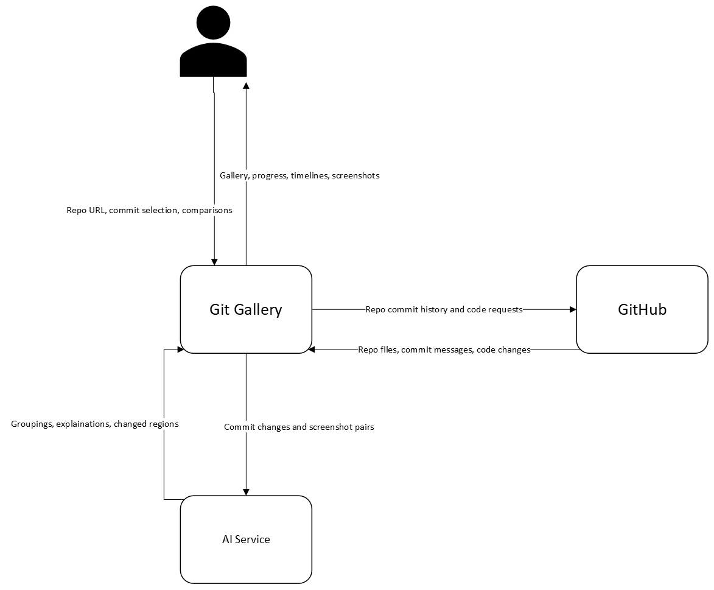

# **Sprint 0 Artifact – Group 2**

### **Project Title: Git Gallery**

Group Members: Frank Baiata, Olena Fedochynska, Jordan Tisdol, Mariella Wood, Kailani Valladares

## Project Description: 

Git, an industry standard version control tool, only produces text results when showing differences between code commits. This is useful for developers, but almost useless for a non-technical audience like designers or managers. *Git* *Gallery* instead produces visual results for the changes between commits for these users to view and compare how a webpage looked as it was changed over time.

The project will be narrowly scoped to ensure the team can complete it with the time given. *Git Gallery* accepts a link to a public GitHub repository and with a few additional (but optional) setup steps, produces the visual timeline for your project. The requirements to be an acceptable repository will be strict to ensure simple, repeatable functionality. The submitted GitHub project must be a simple HTML, CSS, and JavaScript website, with other criteria to ensure that it can be processed.

AI supports the project by selecting commits and interpreting their visual differences. It reviews commit messages and code changes to group consecutive commits into related milestones and recommends which commits to capture. For a selected screenshot pair, AI provides explanations of visible changes and highlights the areas of change.

## Context Diagram: 

Git Gallery is shown as one system in the context diagram. A user (project manager or web designer) provides repositories, commit selections and receives the gallery, progress info, timelines, screenshots, and comparisons. GitHub provides repository files and commits histories. The AI service receives commit-change info or screenshot pairs and returns grouping recommendations or visual analysis. Internal parts of Git Gallery have not been represented here, like database, processing, storage, etc.

### Epics:

<u>Overview</u>:

- Epic 1: GitHub Repository URL Submission

User Stories: 1-4

- Epic 2: Timeline Navigation

User Stories: 5-9

- Epic 3: Project Gallery

User Stories: 10-12

- Epic 4: Commit Screenshots and Processing Status

User Stories: 13-15

- Epic 5: AI Visual Change Analysis

User Stories: 16

- Epic 6: AI Commit Grouping and Setup Recommendations

User Stories: 17

### <u>Epic 1: GitHub Repository URL Submission</u>

Description: Let a user submit a supported repository and control which HTML page and commits will be captured

#### *US-01 — Submit a Public GitHub Repository*
**User Story:**  
As a **User**, I want to submit a public GitHub repo URL, so that I can explore the website's visual timeline history.

**Acceptance criteria:**

- **AC1:** **Given** the submission form is open, **when** I submit an accessible public GitHub repository URL, **then** the system identifies the repository and proceeds to its compatibility check.

- **AC2:** **Given** the URL field is empty, **when** I submit the form, **then** the system explains the input problem and allows me to try again.

- **AC3:** **Given** I entered a malformed URL, a non-GitHub URL, or a URL that does not identify a repository, **when** I submit it, **then** the system explains the input problem and allows me to try again.

- **AC4:** **Given** the repository is private, unavailable, or cannot be reached, **when** the system checks access, **then** the system explains the input problem and allows me to try again.

#### *US-02 — Check Repository Compatibility*
**User Story:**  
As a **User**, I want to know if my repository meets the required rules to be processed by Git Gallery, so that I can either fix an issue or proceed processing.

**Acceptance criteria:**

- **AC1:** **Given** an accessible repository contains a supported self-contained static website and 1–50 commits in the supported default-branch history, **when** compatibility checking completes, **then** the system makes project setup available.

- **AC2:** **Given** the default-branch history contains more than 50 commits, **when** compatibility checking completes, **then** the system rejects the repository with a message stating the 50-commit limit.

- **AC3:** **Given** the submitted website requires an unsupported dependency, **when** compatibility checking completes, **then** the system rejects the repository with a message stating the unsupported dependency.

- **AC4:** **Given** the repository has no usable default branch, no commits, or no selectable HTML page, **when** compatibility checking completes, **then** the system rejects the repository and identifies the missing prerequisite.

- **AC5:** **Given** a previously saved project fails a new compatibility check, **when** the rejection is displayed, **then** its earlier saved analyses remain accessible and unchanged.

#### *US-03 — HTML Page Selection*
**User Story:**  
As a **User**, I want to choose the HTML page followed by the timeline, so that I can examine the page that interests me.

**Acceptance criteria:**

- **AC1:** **Given** the repository contains the recognized homepage, **when** I open project setup, **then** that page is shown as the default capture target.

- **AC2:** **Given** another HTML page exists in the repository, **when** I select it, **then** the setup displays its repository-relative path as the analysis's single target page.

#### *US-04 — Review and Adjust Selected Commits*
**User Story:**  
As a **User**, I want to review and adjust the commits selected for capture, so that the timeline includes the versions I want to examine.

**Acceptance criteria:**

- **AC1:** **Given** a supported history contains 2–50 commits, **when** analysis setup opens, **then** up to 10 distinct commits are preselected across the ordered history, including its first and last commits; all commits are selected when there are 10 or fewer.

- **AC2:** **Given** the history contains one commit, **when** analysis setup opens, **then** that commit is selected once without inventing an additional version.

- **AC3:** **Given** the commit list is available, **when** I select or deselect a commit, **then** the selected state and selected-count display update to reflect my choice.

- **AC4:** **Given** I have selected no commits or would exceed 10 selections, **when** I attempt to start capture or exceed the limit, **then** the system identifies the 1–10 selection requirement and prevents an invalid analysis from starting.

- **AC5:** **Given** I have reviewed my selection, **when** I start the analysis, **then** the submitted page path and exact selected commit identities are shown with that analysis and are not replaced by later changes to the repository.

### <u>Epic 2: Timeline Navigation</u>

Description: Let a reviewer follow the selected website versions over time and understand which commit corresponds to a visual change.

#### *US-05 — Browse the Visual Timeline*
**User Story:**  
As a **Reviewer**, I want to browse the selected projects timeline in chronological order, so that I can follow how the webpage developed over time.

**Acceptance criteria:**

- **AC1:** **Given** an analysis has finished processing, **when** I open its timeline, **then** its selected versions appear in the established oldest-to-newest history order.

- **AC2:** **Given** some selected captures failed, **when** I browse the timeline, **then** those versions remain identifiable as failed entries rather than silently disappearing from the selected history.

- **AC3:** **Given** the analysis contains a single captured version, **when** I open its timeline, **then** the version is viewable, and the interface does not imply that a two-version comparison is available.

#### *US-06 — Inspect Commit Information*
**User Story:**  
As a **Reviewer**, I want to inspect a version’s commit information, so that I can connect its appearance to its author and inspect other git details.

**Acceptance criteria:**

- **AC1:** **Given** a timeline entry is available, **when** I request its commit information, **then** I can view the commit message, recorded author name, commit date and commit identifier.

- **AC2:** **Given** I move between timeline entries, **when** the details change, **then** the displayed information belongs to the currently selected commit.

- **AC3:** **Given** a capture failed, **when** I inspect that entry, **then** its commit information and capture failure reason remain available even though it has no screenshot.

#### *US-07 — View Captured Screenshot*
**User Story:**  
As a **Reviewer**, I want to see the screenshot for the selected commit, so that I can examine the webpage at that point of development.

**Acceptance criteria:**

- **AC1:** **Given** a timeline entry has a successful capture, **when** I select that point on the timeline, **then** the system displays its saved screenshot.

- **AC2:** **Given** a selected entry has no usable screenshot, **when** I open it, **then** the system shows the recorded failure or unavailable-result state instead of substituting another commit's screenshot.

#### *US-08— Select two Versions for Comparison*
**User Story:**  
As a **Reviewer**, I want to choose two captured versions from one project, so that I can compare the points in development that interest me.

**Acceptance criteria:**

- **AC1:** **Given** an analysis contains at least two successful captures, **when** I select two different captured versions, **then** the system makes their comparison available.

- **AC2:** **Given** fewer than two distinct successful versions are selected, **when** I attempt to open a comparison, **then** the system identifies the need for two different successful captures.

- **AC3:** **Given** a version failed capture, **when** I inspect the available comparison choices, **then** that version is identified as unavailable for screenshot comparison.

#### *US-09 — Compare Screenshots Side by Side*

**User Story:**  
As a **Reviewer**, I want to view two selected screenshots side by side, so that I can directly examine how the page changed.

**Acceptance criteria:**

- **AC1:** **Given** a valid screenshot pair is selected, **when** I open the comparison, **then** both screenshots are displayed side by side with their respective commit identifiers and dates.

- **AC2:** **Given** the selected versions have a known history order, **when** their comparison opens, **then** the earlier and later versions are clearly labeled and consistently positioned.

### <u>Epic 3: Project Gallery</u>

Description: Let users find submitted repositories, reopen previous projects, and request updates to projects while keeping previous results.

#### *US-10 — Browse the Shared Project Gallery*

**User Story:**  
As a **User**, I want to browse submitted repositories in a shared gallery, so that I can find the projects available to explore.

**Acceptance criteria:**

- **AC1:** **Given** projects exist, **when** I open the gallery, **then** I can identify each project by its repository owner, repository name, and Project Name.

- **AC2:** **Given** a repository's first valid analysis has started, **when** I open the gallery, **then** that repository has a project entry from which its analysis and current status can be reached.

- **AC3:** **Given** no projects have been created, **when** I open the gallery, **then** an empty state explains that no projects are available and provides access to repository submission.

- **AC4:** **Given** another person uses the same Git Gallery installation, **when** they open the gallery without signing in, **then** they can access the same shared projects and saved analyses.

#### *US-11 — Reopen an Existing Project*

**User Story:**  
As a **User**, I want to reopen a previous project, so that I can continue exploring without resubmitting or regenerating it.

**Acceptance criteria:**

- **AC1:** **Given** a project is available in the gallery, **when** I select it, **then** the system opens its saved timeline or recorded failure details without requiring the repository URL again.

- **AC2:** **Given** the analysis contains saved screenshots and commit information, **when** I reopen it, **then** those saved results are used without generating new screenshots.

#### *US-12 — Update an Existing Project*

**User Story:**  
As a **User**, I want to request an update for an existing project, so that I can examine newer development while keeping earlier results.

**Acceptance criteria:**

- **AC1:** **Given** a project already exists, **when** I request an update, **then** the system checks the repository's current eligibility and provides page and commit selection for the new project.

- **AC2:** **Given** I confirm a valid new selection, **when** processing starts, **then** a distinct project is added to the gallery without replacing earlier projects.

- **AC3:** **Given** the repository now exceeds 50 commits or is otherwise unsupported, **when** I request an update, **then** the system explains the rejection and preserves access to its earlier saved projects.

### <u>Epic 4: Commit Screenshots and Processing Status</u>

Description: Capture the selected historical versions and show progress, successful results, and any failures.

#### *US-13 — Capture Selected Historical Versions*

**User Story:**  
As a **User**, I want to capture screenshots of my selected historical versions, so that I can see how the chosen webpage appeared at those commits.

**Acceptance criteria:**

- **AC1:** **Given** a supported repository, a valid target page, and 1–10 selected commits, **when** I start an analysis, **then** the system creates an identifiable project associated with that repository, page, and selection.

- **AC2:** **Given** the selected page can be rendered at a selected commit, **when** its capture completes, **then** a full-page screenshot is saved and associated with that exact commit and page.

- **AC3:** **Given** multiple versions are captured, **when** their screenshot properties are inspected, **then** the fixed desktop viewport setting is consistent across them while full-page image heights may differ with the content.

#### *US-14 — Follow Processing Progress*

**User Story:**  
As a **User**, I want to see a projects processing progress and return to it later, so that I can use Git Gallery while screenshots are being generated.

**Acceptance criteria:**

- **AC1:** **Given** an analysis has started, **when** I view it in the Gallery, **then** the system shows its current status and the number of processed versions out of the selected total.

- **AC2:** **Given** an analysis is processing and Git Gallery remains running, **when** I navigate away, refresh, or close the browser, **then** processing continues independently of that browser page.

- **AC3:** **Given** I return to the project through the gallery, **when** I open its analysis, **then** I see the current saved status and progress instead of restarting the analysis.

#### *US-15 — Use Results When Some Captures Fail*

**User Story:**  
As a **User**, I want to retain successful screenshots when another selected version fails, so that I can still explore the usable parts of the website's history.

**Acceptance criteria:**

- **AC1:** **Given** a selected version cannot be captured, **when** its capture attempt ends, **then** the system records that version as failed with a reason and continues attempting the remaining selected versions.

- **AC2:** **Given** all capture attempts have finished with both successes and failures, **when** the final outcome is displayed, **then** the analysis is marked “Partially Complete” and its successful screenshots remain available.

- **AC3:** **Given** all selected versions were captured successfully, **when** processing finishes, **then** the analysis is marked Complete.

- **AC4:** **Given** no selected version could be captured, **when** processing finishes, **then** the analysis is marked Failed, the recorded reasons remain visible, and the system does not present an empty result as a successful timeline.

### <u>Epic 5: AI Visual Change Analysis</u>

Description: Explain the visible differences between two captured versions, highlight their locations, and preserve completed comparisons.

#### *US-16 — Request an AI Explanation of Visual Changes*

**User Story:**  
As a **Reviewer**, I want to receive an AI explanation of the visible differences between two screenshots, so that I can understand the interface changes without interpreting source code.

**Acceptance criteria:**

- **AC1:** **Given** a valid comparison pair is open and no successful AI comparison is saved for it, **when** I request AI comparison, **then** the system analyzes the selected screenshots and identifies which pair the request concerns.

- **AC2:** **Given** a successful result identifies visual changes, **when** the explanation is displayed, **then** it describes the affected page elements and their visible before-and-after differences, such as position, color, text, size, or presence.

- **AC3:** **Given** the screenshots do not establish a backend behavior, developer intention, or interactive behavior, **when** the explanation is displayed, **then** it does not present those inferred claims as facts established by the screenshots.

- **AC4:** **Given** AI identifies no visible differences, **when** its successful result is displayed, **then** the interface explicitly reports that no visual differences were identified and does not invent a change list.

### <u>Epic 6: AI Commit Grouping and Setup Recommendations</u>

Description: Group consecutive commits into related milestones and recommend representative versions for the user to review before capture.

#### *US-17 — Review AI-Generated Commit Groups*

**User Story:**  
As a **User**, I want to review AI-generated groups of consecutive commits, so that I can understand the related development milestones represented in the repository's history.

**Acceptance criteria:**

- **AC1:** **Given** a supported repository history and its code changes are available, **when** I request AI commit grouping, **then** the system presents groups with a descriptive title, a short explanation, and their member commits.

- **AC2:** **Given** grouping results are displayed, **when** I inspect a group, **then** every member is a real commit from the analyzed history, and the members occupy a consecutive span in the displayed history order.

- **AC3:** **Given** the complete grouping result is displayed, **when** I review its membership, **then** every analyzed commit belongs to exactly one group, with no duplicates or omitted commits; a single-commit group is allowed.

- **AC4:** **Given** AI identifies a group as a likely UI milestone, **when** I inspect its explanation, **then** it identifies the supporting commit messages or changed website files and presents its visual significance as a recommendation to verify through screenshots.

### Kanban Board:

###  <https://github.com/FrankB45/csc325-capstone/projects> 

### AI Use Disclosure:

Organizing and refining the project requirements and user stories were done with the help of AI tools. The user stories and acceptance criteria were also enhanced using AI to refine the text and organization. The project team has read through and commented on the AI-generated text, and it has been edited to meet the requirements of the project and the desired functions. The project team made its own decisions regarding the scope, requirements, and design of the project. ChatGPT 6 Astra was used throughout the process. Specifically, it interviewed us to ensure completeness of the application and clarify gaps. Helped generate acceptance criteria.
